<link
  href="https://cdnjs.cloudflare.com/ajax/libs/font-awesome/6.5.1/css/all.min.css"
  rel="stylesheet"
/>

### New approach:

```mermaid
%% new approach
flowchart BT
	user["user🛉"]
	keyboard["`**UI1**: keyboard 🖮`"]
	pedals["`**UI2**: pedals 🖮`"]
    MacroKeyboard["`**UI3**: macro keyboard 🖮`"] 
	screen[screen fa:fa-display]
	OperatingSystem[operating system <i class="fa-brands fa-windows"></i>]
	editor[e.g. editor fa:fa-spell-check]
	TextPrediction["`**T1**: text prediction fa:fa-file-code`"]
	TextExpansion["`**T2**: text expansion fa:fa-file-code`"]
    MacroProcessing["`**T3**: macro processing fa:fa-file-code`"]

    user	-->	 |typing| keyboard
    user	-->	 |typing| pedals
    user    -->  |press| MacroKeyboard
    
    subgraph programmable input devices
        keyboard
        pedals
        MacroKeyboard
    end

    subgraph "`**Personal Computer**`"
        
        style TextPrediction 	fill:lightblue
        style TextExpansion 	fill:lightblue
        style MacroProcessing   fill:lightblue, stroke-dasharray:5

        subgraph "`**AutoHotkey** applications`"
            TextPrediction
        end

        subgraph "`**AutoHotkey** applications`"
            TextExpansion
        end

        subgraph "`**AutoHotkey** macros`"
            MacroProcessing
        end
   
        OperatingSystem		--> 	TextPrediction
        OperatingSystem		--> 	TextExpansion
        OperatingSystem     -->     MacroProcessing
        
        TextPrediction 		-.-> 	editor
        OperatingSystem		--> 	editor
        TextExpansion 		-.-> 	editor
        MacroProcessing     -.->    editor
    end

        keyboard			--> 	OperatingSystem
        pedals 				--> 	OperatingSystem
        MacroKeyboard       -->     OperatingSystem
        editor	            -->     screen
```

___

### Default / old approach:

Description:

```mermaid
%% default / old approach
flowchart BT
	user["user🛉"]
	keyboard["`keyboard 🖮`"]
	screen[screen fa:fa-display]
	OperatingSystem[operating system fa:fa-windows]
	editor[editor fa:fa-spell-check]

    user	-->	 |typing| keyboard

    subgraph "`**Personal Computer**`"
	    OperatingSystem		--> 	editor
    end

    keyboard			--> 	OperatingSystem
    editor	--> screen
```

___

### Hybrid approach, programmable input devices:

```mermaid
%% hybrid approach 1
flowchart BT
	user["user🛉"]
	keyboard["`**UI1**: keyboard 🖮`"]
	pedals["`**UI2**: pedals`"]
    MacroKeyboard["`**UI3**: macro keyboard 🖮`"] 
	screen[screen fa:fa-display]
	OperatingSystem[operating system fa:fa-windows]
	editor[editor fa:fa-spell-check]

    user	-->	 |typing| keyboard
    user	-->	 |typing| pedals
    user    -->  |press| MacroKeyboard
    
    subgraph programmable input devices
        keyboard
        pedals
        MacroKeyboard
    end

    subgraph "`**Personal Computer**`"
        
        OperatingSystem		--> 	editor
    end

        keyboard			--> 	OperatingSystem
        pedals 				--> 	OperatingSystem
        MacroKeyboard       -->     OperatingSystem

    editor	--> screen
```

___

### Hybrid approach, additional applications

```mermaid
%% hybrid approach 2
flowchart BT
	user["user🛉"]
	keyboard["`keyboard 🖮`"]
	screen[screen fa:fa-display]
	OperatingSystem[operating system fa:fa-windows]
	editor[editor fa:fa-spell-check]
	TextPrediction["`**T1**: text prediction fa:fa-file-code`"]
	TextExpansion["`**T2**: text expansion fa:fa-file-code`"]
    MacroProcessing["`**T3**: macro processing fa:fa-file-code`"]

    user	-->	 |typing| keyboard
    
    subgraph "`**Personal Computer**`"
        
        style TextPrediction 	fill:lightblue
        style TextExpansion 	fill:lightblue
        style MacroProcessing   fill:lightblue, stroke-dasharray:5

        subgraph "**AutoHotkey applications**"
            TextPrediction
        end

        subgraph "`**AutoHotkey** applications`"
            TextExpansion
        end
   
        subgraph "`**AutoHotkey** macros`"
            MacroProcessing
        end

        OperatingSystem		--> 	TextPrediction
        OperatingSystem		--> 	TextExpansion
        OperatingSystem		--> 	MacroProcessing
        
        TextPrediction 		-.-> 	editor
        OperatingSystem		--> 	editor
        TextExpansion 		-.-> 	editor
        MacroProcessing     -.-> 	editor
    end

        keyboard			--> 	OperatingSystem
        editor	            --> screen
```

