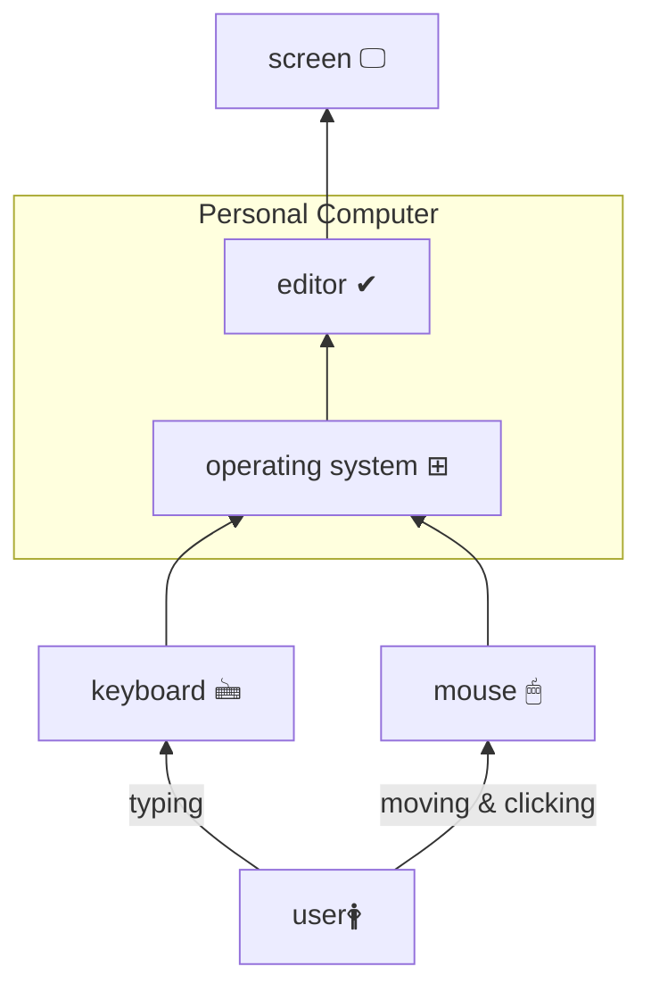
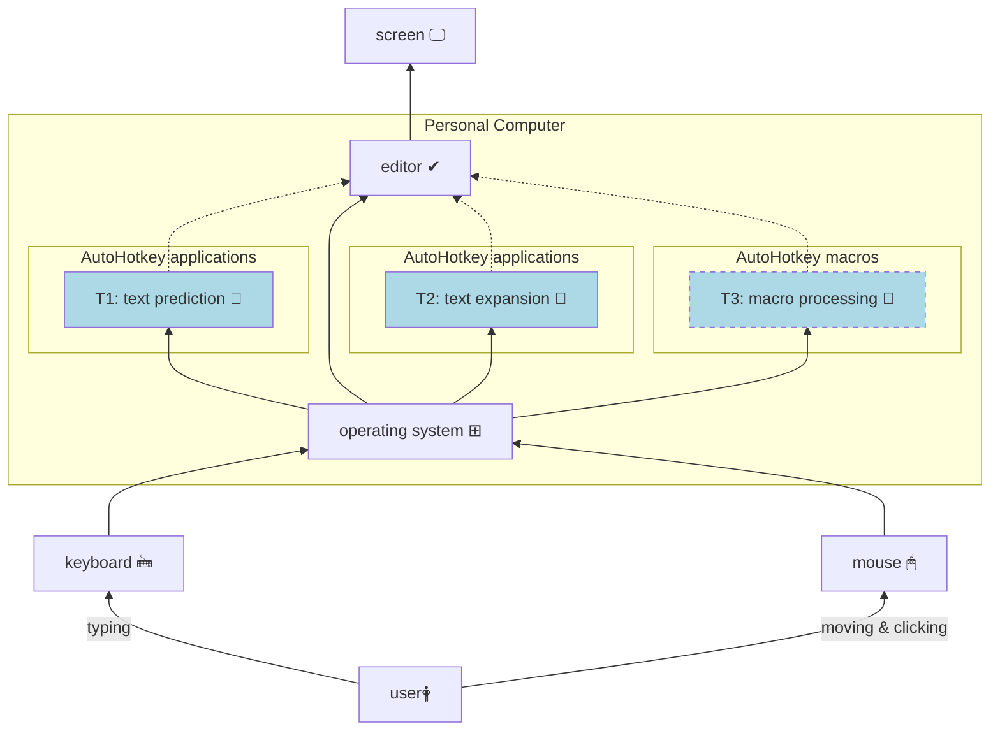
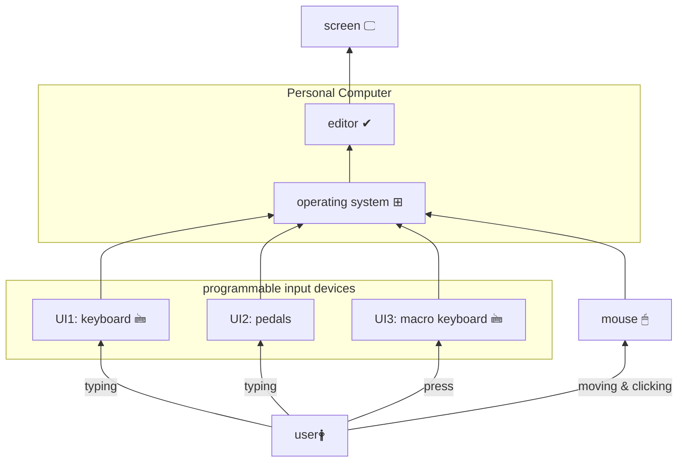
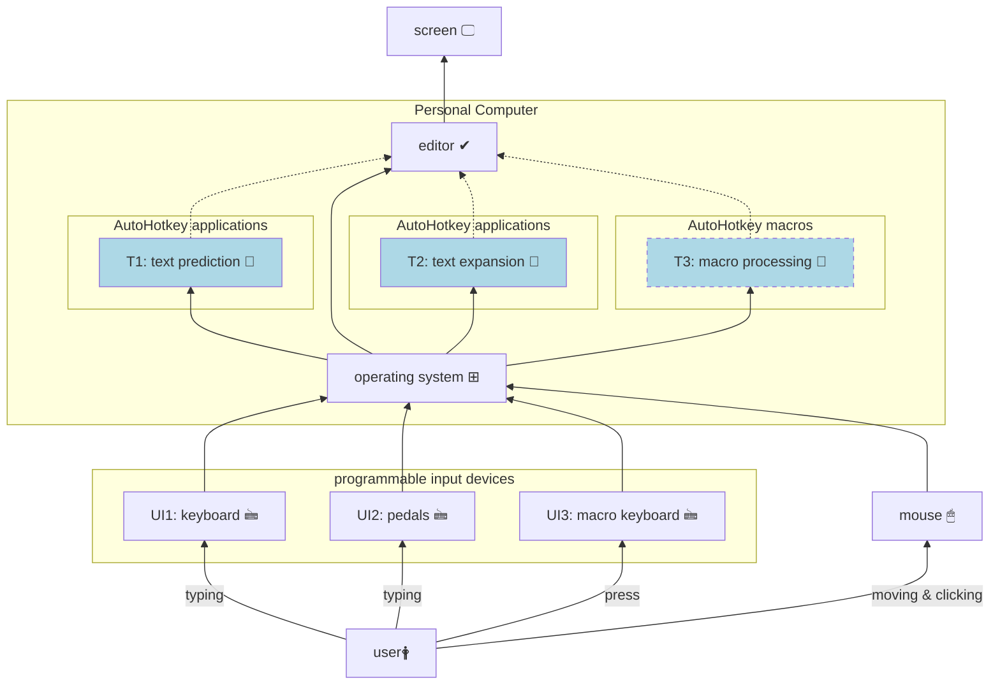

**Info**: The formatting of this document works exclusively for the Markdown GitHub renderer. There is a separate file *[BlockDiagrams_VSC.md][]* which is formatted a bit differently, according to renderer rules of Visual Studio Code (VSC).
___

# Introduction
This article presents a general vision, an overview of hardware and software tools useful to reduce the overhead with a Personal Computer (PC).

## Why it is important?

I type a lot, every day, both on the job and in my spare time. It is a core and chore part of professional and personal life. On average, I press between 15,000 and 25,000 keystrokes a day. Any reduction is welcome, as it would save both time and effort in my life.

## What can we do about it?

We can do a lot. We can can change our working habits, use additional / special software, use additional hardware. What would really be effective is combination of all of the above. But not all at the same time, so let's look at what is really possible and choose what could be effective for you.

## Micro habits are hard to change

The way we use our keyboard and mouse could definitely be called micro habits. Maybe some of you have thought about how to type without looking at the keyboard (called touch typing). Maybe some of you mainly use shortcuts to get things done quickly. Maybe you just type and move your mouse without thinking about efficicency and optimisation, just to get the job done. Let's just ask ourselves honestly where we are.

In fact, our live is about adapting, changing: ourselves, our environment to ourselves. This task is still left aside starting from upbringing, through education. We are not thought about how to imply a change in our life. It's about self-management, so it requires measurement, closing a loop that lets us control where we are, how far we are from our values and goals. This is definitely a subject that is far from the subject of this article. Nevertheless, you've been warned: it is at least uncomfortable.

# Where we are today, a traditional approach

The traditional approach is illustrated in Figure 1. A **user 🛉** enters information by typing on a conventional non-programmable **keyboard 🖮** and/or by moving, pointing and clicking a **mouse 🖱**. The keyboard and mouse are connected to the **Personal Computer** via a serial interface (e.g. USB). There the information is processed by an **operating system ⊞** (e.g. Microsoft Windows) and a dedicated application, e.g. probably a text **editor ✓**. After processing, the result is displayed on a **screen 🖵**. What is not shown, for simplicity sake, is feedback from what we as a **user 🛉** see on a **screen 🖵** to our mind, then it is processed and something new is entered by **keyboard 🖮** and/or **mouse 🖱** again, closing a loop.

Nothing fancy, I suppose. I was there, too, and know this image well. Out of a box, the vast majority of everyday tasks can be accomplished simply by applying the tools shown in **Figure 1**. Aren't they?

First of all, it's good to know how much you type and move your mouse on a daily basis. Surprisingly, the answer to this question is not so easy to find. Operating systems do not provide this information. The reason is simple: to tell you, how many keys you are pressing, they have to store this information in memory. As long as we enter passwords and other, sometimes sensitive, information into our computers by typing, there is always a risk that non-transparent software will make unwatend use of the recorded infomation. 

#### Figure 1. The traditional approach.

___

# The Hybrid approach, additional applications

Modern operating systems are flexible enough to run multiple software applications at the same time. So let's use additional software, as shown in **Figure 2**:
- **T1**: text prediction 📑
- **T2**: text expansion 📑
- **T3**: macro processing 📑

Predictive text input is a category of applications that try to guess what you're going to type next. The hints are displayed near a text cursor or mouse pointer so that you can quickly select a proper word if you see one of the hints.

Text expantion is a category of applications that store short text definitions in the computer's memory that can be automatically expanded into much longer pieces of text. The existing short text definitions aka text triggerstrings can be displayed as a hint to you, based on letters you've typed already. For example, the short text definition `e@` can be expanded to `your.e-maildress@whatever.com`.

The macro processing is a category of applications that can even use dedicated hardware if necessary. We usually work with the same applications each day. Usually they allow us to access all the functions we need through a menu, then a sub-menu, then another sub-menu. Sometimes it is not possible to customise graphical user interface of such an application in such a way that we could easily reach the desired function. This is when specialised tools come in handy, allowing you to store  a sequence / combinations of pressed keyboard keys, mouse movements and clicks in the computer's memory. Then you can quickly execute the whole sequence by pressing a single key, such as `F9`. This category sometimes comes with the aid of a dedicated keyboard or touch screen, which is not shown in the following picture for clarity.

#### Figure 2. The hybrid approach, additional software.
___

# The Hybrid approach, programmable input devices

It is possible to gain additional level of freedom and customization by application of programmable **User Input** (UI) devices:
- **UI1**: keyboard 🖮
- **UI2**: pedals
- **UI3**: macro keyboard 🖮

The (programmable) **keyboard** lets you to customize it to your liking. For example you might want to use sequences that replace opening parenthesis, e.g. `(` with a sequence of pairs of parenthesis `()`, and then move the cursor back one character to place it between the two parenthesis so that you are ready to type? Or maybe you want to permanently place the question mark character `?` in the position of the square bracket key `]`: `?` → `]`? Or maybe you want to experiment with different keyboard layouts and use for example `Dvorak` instead of the default `qwerty`? All this and much more is possible if you can reprogram your keyboard to become **your keyboard**.

The (programmable) **pedals** are actually a kind of keyboard. They usually have 1÷3 big "keys" that you can press with your foot. They are excellent for well-defined keyboard shortcuts. For example, the left one can be used to copy (`Control + C`), the middle one to cut (`Control + X`), and the right one to paste (`Control + V`). Or you can use them to select the correct hint from the **text prediction** software application, mentioned in the section above.

The (programmable) **macro keyboard** can actually be a dedicated "second" keyboard, but even more practical would be a small touch screen. This gives you much more flexibility if you want to change an icon or key layout. The macro keyboard is not for typing, but for occassional pressing the right key to perform pre-recorded actions, such as keystrokes, mouse clicks etc.

#### Figure 3. The hybrid approach, programmable input devices.

___

# The new approach

The new approach combines all the above suggestions into one **system**: your true **personal computer**. In other words, there is a lot be improved with relatively inexpensive tools.

#### Figure 4. The new approach.

___

# Typing: serial vs. chording

The nature of the vast majority of computer keyboards is based on the old idea of **typewriter**: serialised input of characters. So if the characters did not come one after another, not serially, the mechanical arms of the typewriter jammed. For reasons not fully understood, this way of typing has accompanied our civilization to this day.

There is an alternative. Let's think for a moment about a piano keyboard: 🎹. We produce sounds by pressing a few keys at the same time. Thanks to this, a produced sound is to some extent a reacher. This sound is usually called a **chord**. Of course we can play serially on a piano keyboard, but we can hear that we get more by pressing the keys simultaneously.

The same idea could be applied for typing text. Pressing the computer keyboard at the same time would create words. Thanks to this solution we can type faster. This way of entering information is called [stenotyping][]. It usually requires special hardware and software. There is an open software and hardware project to learn this skill called the [Open Steno Project][]. And there are also commercial solutions, such as [CharaCorder][]

So before you consider whether it is worth starting your journey by learning of [touch typing][], consider the alternatives.

___

# What am I working on? What's my solution to the above challenges?

Below are some tips and suggestions from my side. These are mainly tools that I use every day.

## How many times do you press your keyboard keys and what is a distance travelled by your mouse body?

As I don't fully trust existing "key loggers", I wrote one myself. This is just a script, so it doesn't run by itself and it is fully transparent, if you wish to examine it. It is called **[KeyboardAndMouseStats][]** and is currently able to provide statistics about the keys pressed. It also estimates the distance your mouse has moved over a surface. The script is written in [AutoHotkey][] scripting language and published on GitHub.

## Text expansion tool: Hotstrings

The **Hotstrings** application is my personal attempt to create the best **text expansion** application in the world. It is available in two versions: [Hotstrings free][] is publicly available on GitHub. The [Hotstrings commercial][] is available on a dedicated website. Both releeases are written in the scripting language [AutoHotkey][].

## Macro keyboard: Otagle

I have few attempts to build and use a macro keyboard. My latest approach is [Otagle][] script, which uses a small, dedicated touch screen for this purppose.

## Text prediction tool: TypingAid 

This is not my application, but it's worth a try. Written entirely in [AutoHotkey][], the [TypingAid][] is a free way  to see if predictive text input is for you. Who knows, maybe in future I'll delve deeper into writing this application as well, as it currently conflicts with **Hotstrings**.

## Programmable keyboards

For everyday use I still use a "traditional" 60% mechanical keyboard, which is not even programmable. For the time being I cover some of its shortcomings with [AutoHotkey][] scripts, especially with **Hotstrings**. 

My plan for the coming months is to build a fully ergonomic 32-keys-only keyboard, programmable with [QMK firmware][].

___

Thanks for reading. This article is a kind of overview and also manifesto of what I'm trying to do. If you think this could be useful for you, let's get in touch.

[BlockDiagrams_VSC.md]: /BlockDiagrams_VSC.md
[stenotyping]: https://en.wikipedia.org/wiki/Stenotype
[Open Steno Project]: http://www.openstenoproject.org/
[CharaCorder]: https://www.charachorder.com/
[touch typing]: https://en.wikipedia.org/wiki/Touch_typing
[AutoHotkey]: https://www.autohotkey.com/
[KeyboardAndMouseStats]: https://github.com/mslonik/KeyboardAndMouseStats
[Hotstrings free]: https://github.com/mslonik/Hotstrings
[Hotstrings commercial]: https://hotstrings.technology/
[Otagle]: https://github.com/mslonik/Otagle
[TypingAid]: https://github.com/ManiacDC/TypingAid
[QMK firmware]: https://qmk.fm/