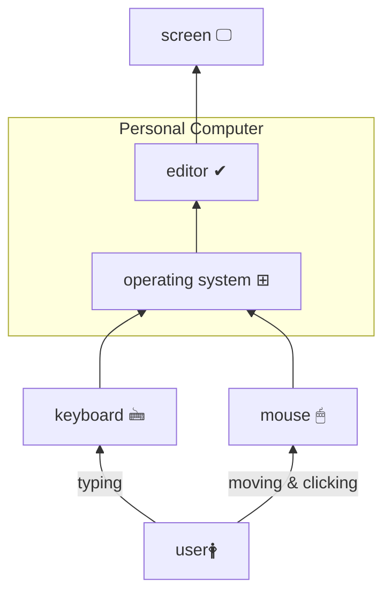
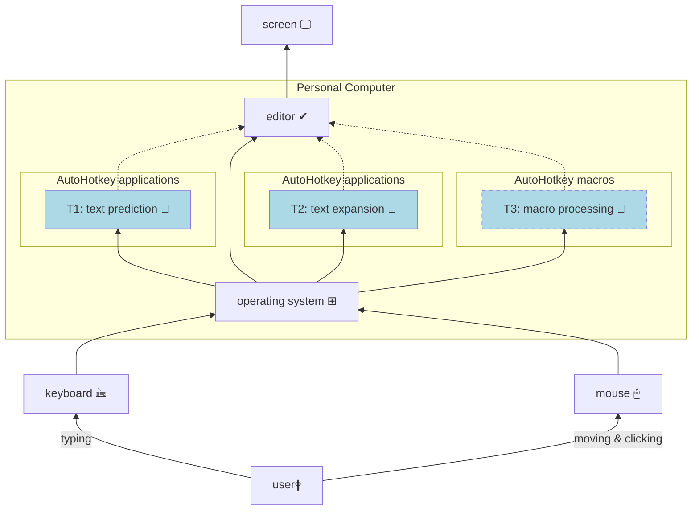
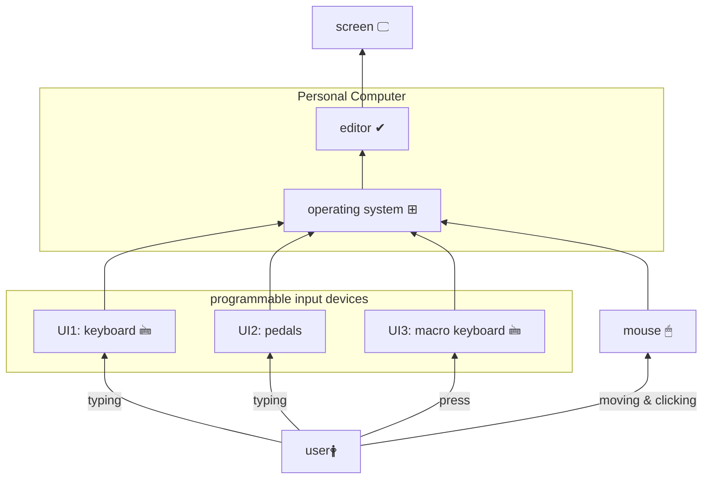
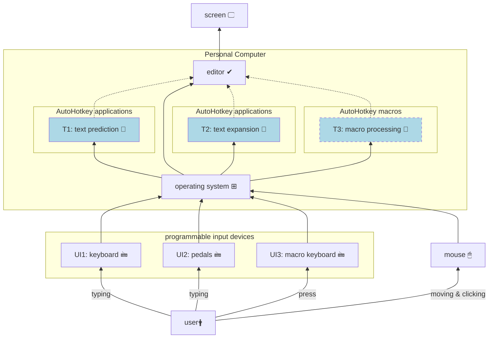

**Info**: The formatting of this document works exclusively for the Markdown GitHub renderer. There is a separate file *[BlockDiagrams_VSC.md][]* which is formatted a bit differently, according to renderer rules of Visual Studio Code (VSC).
___

# Introduction
This article presents a general vision, an overview of hardware and software tools useful to reduce the overhead with a Personal Computer (PC).

## Why it is important?

I type a lot, every day, both on the job and in my spare time. It is a core and chore part of professional and personal life. On average, I press between 15,000 and 25,000 keystrokes a day. Any reduction is welcome, as it would save both time and effort in my life.

## What can we do about it?

We can do a lot. We can can change our working habits, use additional / special software, use additional hardware. What would really be effective is combination of all of the above. But not all at the same time, so let's look at what is really possible and choose what could be effective for you.

## Micro habits are hard to change

The way we use our keyboard and mouse could definitely be called micro habits. Maybe some of you have thought about how to type without looking at the keyboard (called touch typing). Maybe some of you mainly use shortcuts to get things done quickly. Maybe you just type and move your mouse without thinking about efficicency and optimisation, just to get the job done. Let's just ask ourselves honestly where we are.

In fact, our live is about adapting, changing: ourselves, our environment to ourselves. This task is still left aside starting from upbringing, through education. We are not thought about how to imply a change in our life. It's about self-management, so it requires measurement, closing a loop that lets us control where we are, how far we are from our values and goals. This is definitely a subject that is far from the subject of this article. Nevertheless, you've been warned: it is at least uncomfortable.

# Where we are today, a traditional approach

The traditional approach is illustrated in Figure 1. A **user 🛉** enters information by typing on a conventional non-programmable **keyboard 🖮** and/or by moving, pointing and clicking a **mouse 🖱**. The keyboard and mouse are connected to the **Personal Computer** via a serial interface (e.g. USB). There the information is processed by an **operating system ⊞** (e.g. Microsoft Windows) and a dedicated application, e.g. probably a text **editor ✓**. After processing, the result is displayed on a **screen 🖵**. What is not shown, for simplicity sake, is feedback from what we as a **user 🛉** see on a **screen 🖵** to our mind, then it is processed and something new is entered by **keyboard 🖮** and/or **mouse 🖱** again, closing a loop.

Nothing fancy, I suppose. I was there, too, and know this image well. Out of a box, the vast majority of everyday tasks can be accomplished simply by applying the tools shown in **Figure 1**. Aren't they?

First of all, it's good to know how much you type and move your mouse on a daily basis. Surprisingly, the answer to this question is not so easy to find. Operating systems do not provide this information. The reason is simple: to tell you, how many keys you are pressing, they have to store this information in memory. As long as we enter passwords and other, sometimes sensitive, information into our computers by typing, there is always a risk that non-transparent software will make unwatend use of the recorded infomation. 

#### Figure 1. The traditional approach.

___

# The Hybrid approach, additional applications

Modern operating systems are flexible enough to run multiple software applications at the same time. So let's use additional software, as shown in **Figure 2**:
- **T1**: text prediction 📑
- **T2**: text expansion 📑
- **T3**: macro processing 📑

Predictive text input is a category of applications that try to guess what you're going to type next. The hints are displayed near a text cursor or mouse pointer so that you can quickly select a proper word if you see one of the hints.

Text expantion is a category of applications that store short text definitions in the computer's memory that can be automatically expanded into much longer pieces of text. The existing short text definitions aka text triggerstrings can be displayed as a hint to you, based on letters you've typed already. For example, the short text definition `e@` can be expanded to `your.e-maildress@whatever.com`.

The macro processing is a category of applications that can even use dedicated hardware if necessary. We usually work with the same applications each day. Usually they allow us to access all the functions we need through a menu, then a sub-menu, then another sub-menu. Sometimes it is not possible to customise graphical user interface of such an application in such a way that we could easily reach the desired function. This is when specialised tools come in handy, allowing you to store  a sequence / combinations of pressed keyboard keys, mouse movements and clicks in the computer's memory. Then you can quickly execute the whole sequence by pressing a single key, such as `F9`. This category sometimes comes with the aid of a dedicated keyboard or touch screen, which is not shown in the following picture for clarity.

#### Figure 2. The hybrid approach, additional software.
___

# The Hybrid approach, programmable input devices

It is possible to gain additional level of freedom and customization by application of programmable **User Input** (UI) devices:
- **UI1**: keyboard 🖮
- **UI2**: pedals
- **UI3**: macro keyboard 🖮

The (programmable) **keyboard** lets you to customize it according to your liking. For example perhaps you would like to use sequences, which replace opening bracket, e.g. `(` with sequence of pair bracket `()` and additionally move back position of cursor by one character to place it in between both brackets, to make you ready for typing? Or maybe you would like to place permanently question mark character `?` in position of square bracket key `]`: `?` → `]`? Or maybe you would like to experiment with different keyboard layout and instead of the default one, `qwerty` use for example `Dvorak`? All of this and much more is possible, if you can reprogram your keyboard, which will start to be **yours**.

The (programmable) **pedals** are actually a kind of keyboard. Usually it has 1÷3 big "keys", ready to be pressed by foot. They are excellent for well defined keyboard shortcuts. For example left one can be used for copying (`control + C`), middle for cutting (`control + V`), the right one for pasting (`control + V`). Or you can use them for selecting the right hint coming from **text prediction** software application, mentioned in the section above.

The (programmable) **macro keyboard** actually can be a dedicated "second" keyboard, but more practical would be even a small touch screen. Then you have much more flexibility in case you would like to change an icon or arrangement of keys. The macro keyboard is not for typing, but for occassional pressing the right key, which runs previously recorded set actions, like key presses, mouse clicks etc.

#### Figure 3. The hybrid approach, programmable input devices.

___

# The new approach

The new approach gathers all together all of the above proposals into one **system**: your truly **personal computer**. In other words, there is much to be improved with relatively low cost tools.

#### Figure 4. The new approach.

___

# Typing: serial vs. chording

What you or me, so called **user 🛉**, can do? As usually, a lot.

The nature of vast majority of computer keyboards is based on old idea of **typing machine**: serialized entering the characters. So if characters were not coming one after another, not serially, the mechanical arms of type writer jammed. For not fully understood reasons this way of typing accompany to our civilization till theese days.

There is an alternative. Let's think for a moment about a piano keyboard: 🎹. We produce sounds by parallel, concurrent pressing of few keys. Thanks to that a produced sound is to some degree reacher. That sound is usually called a **chord**. Of course we can play on a piano keyboard serially, but we can hear that we gain more if keys are pressed concurrently.

The same idea actually could be applied for typing of text. Then concurrent presses of computer keyboard would produce words. Thanks to this solution we can type faster. This way of entering information is called [stenotyping][]. To get there usually a dedicated hardware and software are required. There is an open software and hardware project which enable learning this skill called [Open Steno Project][]. And there are also commercial solutions, like [CharaCorder][]

So before considering if it worth to start your journey with learning of [touch typing][], consider alternatives.

___

# What I'm working on? What's my solution to above challenges?

Below you can find some hints and proposals from my side. These are mainly tools which I use everyda.

## How many times do you press your keyboard keys and what is a distance travelled by your mouse body?

As I don't trust fully to any existing "key loggers", I wrote one by myself. This is only a script, so it doesn't run by itself. It is called **[KeyboardStats][]** and at the moment is able to provide statistics about keyboard keys pressed. It also estimates whas is a distance travelled by your mouse over a surface. The script is written in [AutoHotkey][] scripting language and published at GitHub.

## Text expansion tool: Hotstrings

The **Hotstrings** application is my personal attempt to build the best in the world **text expansion** application. It is available in two releases: [Hotstrings free][] is publicly available at GitHub. The [Hotstrings commercial][] is available on dedicated web site. Both releeases are written in [AutoHotkey][] scripting language.

## Macro keyboard: Otagle

I have few attempts to build and use also macro keyboard. My latest approach to this subject is [Otagle][] script, which uses small, dedicated touch screen for that purppose.

## Text prediction tool: TypingAid 

This isn't my application, but I recommend to try it. Written entirely in [AutoHotkey][], the [TypingAid][] let's you for free test if text prediciton is for you. Who knows, maybe in future I'll dive deepter to author this application as well, because currently it conflicts with **Hotstrings**.

## Programmable keyboards

For everyday life I still use "traditional" 60 % mechanical keyboard which is not even programmable. For time being I cover some of its deficiences with [AutoHotkey][] scripts, especially with **Hotstrings**. 

My plan for coming months is to build fully ergonomic 32 keys only keyboard, programmable with [QMK firmware][].

___

Thank you for your reading. This article is a kind of overview and also manifest of what I'll try to do. If you feel this could be beneficial also for you, let's get into touch.

[BlockDiagrams_VSC.md]: /BlockDiagrams_VSC.md
[stenotyping]: https://en.wikipedia.org/wiki/Stenotype
[Open Steno Project]: http://www.openstenoproject.org/
[CharaCorder]: https://www.charachorder.com/
[touch typing]: https://en.wikipedia.org/wiki/Touch_typing
[AutoHotkey]: https://www.autohotkey.com/
[KeyboardStats]: https://github.com/mslonik/KeyboardStats
[Hotstrings free]: https://github.com/mslonik/Hotstrings
[Hotstrings commercial]: https://hotstrings.technology/
[Otagle]: https://github.com/mslonik/Otagle
[TypingAid]: https://github.com/ManiacDC/TypingAid
[QMK firmware]: https://qmk.fm/