**Info**: This formatiing works exclusively for Markdown GitHub renderer.
___

### New approach:

```mermaid
%% new approach
flowchart BT
	user["user🛉"]
	keyboard["UI1: keyboard 🖮"]
	pedals["UI2: pedals 🖮"]
    MacroKeyboard["UI3: macro keyboard 🖮"] 
	screen["screen 🖵"] 
	OperatingSystem["operating system ⊞"]
	editor["editor ✔"]
	TextPrediction["T1: text prediction 📑"]
	TextExpansion["T2: text expansion 📑"]
    MacroProcessing["T3: macro processing 📑"]

    user	-->	 |typing| keyboard
    user	-->	 |typing| pedals
    user    -->  |press| MacroKeyboard
    
    subgraph "programmable input devices"
        keyboard
        pedals
        MacroKeyboard
    end

    subgraph "Personal Computer"
        
        style TextPrediction 	fill:lightblue
        style TextExpansion 	fill:lightblue
        style MacroProcessing   fill:lightblue, stroke-dasharray:5

        subgraph "AutoHotkey applications"
            TextPrediction
        end

        subgraph "AutoHotkey applications"
            TextExpansion
        end

        subgraph "AutoHotkey macros"
            MacroProcessing
        end
   
        OperatingSystem		--> 	TextPrediction
        OperatingSystem		--> 	TextExpansion
        OperatingSystem     -->     MacroProcessing
        
        TextPrediction 		-.-> 	editor
        OperatingSystem		--> 	editor
        TextExpansion 		-.-> 	editor
        MacroProcessing     -.->    editor
    end

        keyboard			--> 	OperatingSystem
        pedals 				--> 	OperatingSystem
        MacroKeyboard       -->     OperatingSystem
        editor	            -->     screen
```

___

### Default / old approach:

```mermaid
%% default / old approach
flowchart BT
	user["user🛉"]
	keyboard["keyboard 🖮"]
	screen["screen 🖵"] 
	OperatingSystem["operating system ⊞"]
	editor["editor ✔"]

    user	-->	 |typing| keyboard

    subgraph "Personal Computer"
	    OperatingSystem		--> 	editor
    end

    keyboard			--> 	OperatingSystem
    editor	--> screen
```

___

### Hybrid approach, programmable input devices:

```mermaid
%% hybrid approach 1
flowchart BT
	user["user🛉"]
	keyboard["UI1: keyboard 🖮"]
	pedals["UI2: pedals"]
    MacroKeyboard["UI3: macro keyboard 🖮"] 
	screen["screen 🖵"] 
	OperatingSystem["operating system ⊞"]
	editor["editor ✔"]

    user	-->	 |typing| keyboard
    user	-->	 |typing| pedals
    user    -->  |press| MacroKeyboard
    
    subgraph "programmable input devices"
        keyboard
        pedals
        MacroKeyboard
    end

    subgraph "Personal Computer"
        
        OperatingSystem		--> 	editor
    end

        keyboard			--> 	OperatingSystem
        pedals 				--> 	OperatingSystem
        MacroKeyboard       -->     OperatingSystem

    editor	--> screen
```

___

### Hybrid approach, additional applications

```mermaid
%% hybrid approach 2
flowchart BT
	user["user🛉"]
	keyboard["keyboard 🖮"]
	screen["screen 🖵"] 
	OperatingSystem["operating system ⊞"]
	editor["editor ✔"]
	TextPrediction["T1: text prediction 📑"]
	TextExpansion["T2: text expansion 📑"]
    MacroProcessing["T3: macro processing 📑"]

    user	-->	 |typing| keyboard
    
    subgraph "Personal Computer"
        
        style TextPrediction 	fill:lightblue
        style TextExpansion 	fill:lightblue
        style MacroProcessing   fill:lightblue, stroke-dasharray:5

        subgraph "AutoHotkey applications"
            TextPrediction
        end

        subgraph "AutoHotkey applications"
            TextExpansion
        end
   
        subgraph "AutoHotkey macros"
            MacroProcessing
        end

        OperatingSystem		--> 	TextPrediction
        OperatingSystem		--> 	TextExpansion
        OperatingSystem		--> 	MacroProcessing
        
        TextPrediction 		-.-> 	editor
        OperatingSystem		--> 	editor
        TextExpansion 		-.-> 	editor
        MacroProcessing     -.-> 	editor
    end

        keyboard			--> 	OperatingSystem
        editor	            --> screen
```

