**Info**: The Markdown style applied in this file is correctly rendered in Visual Studio Code (VSC), but not on GitHub, which doesn't allow any classes. From the other hand the VSC renderer doesn't allow mixing of HTML code with Markdown within []. To see the code formatted for GitHub see [BlockDiagrams_VSC.md][].

# Introduction
This article shows a general vision, overview of hardware and software tools useful to reduce work overhead with Personal Computer (PC).

## Why it is important?

I mainly type, each day. This is a core and chore of my everyday professional and private life. On average I press daily between 15 000 ÷ 25 000 keyboard keys. Any reduction is welcomed, what would save both: time and effort.

## What we can do about it?

A lot. We can can change our working habit, apply additional / dedicated software, use additional hardware. What would be actually really effective is combination of all already mentioned features. But not all at the same time, so let's dive in to examine, what is really possible and what could be effective to you.

## Micro habits are hard to be changed

How we use our keyboards and mouses definitely could be called micro habits. Maybe some of you have been thought how to type without looking onto keyboard (so called touch typing). Maybe some of you use mainly shortcuts to quickly finish some operations. Maybe you just try to finish your job. Let's just ask ourselves, where we are.

Actually our live is about adjusting, customizing, changing: ourselves, our environment to ourselves. This task is still left aside starting from upbringing, through education. We are not thought how to imply a change in our life. This is about self-management, so it requires measurment, closing a loop, which let's us control where we are, how far we are from our values and goals. Definitely this is a subject outgoing far from the subject of this article. Nevertheless, you've been warned: it is uneasy.

# Where we are today, a traditional approach

The traditional approach is shown in Figure 1. A **user 🛉** enters information by typing on common, non-programmable **keyboard 🖮** and/or by moving, pointing and clicking a **mouse 🖱**. The keyboard and mouse are connected via serial interface (e.g. USB) to **Personal Computer**. There information is processed by an **operating system ⊞** (e.g. Microsoft Windows) and dedicated application, e.g. likely text **editor ✓**. Next, after processing, a result is displayed on a **screen 🖵**. What is not shown, to bring simplicity, is a feedback coming from what we, as a **user 🛉**, see on a **screen 🖵** to our mind, then it is processed and something new is entered by **keyboard 🖮** and/or **mouse 🖱** again, closing a loop.

Nothing fancy, I suppose. I was there as well and know this picture well. Out of a box, the vast majority of everyday tasks can be accomplished just by application of the means presented in **Figure 1**. Isn't it?

```mermaid
%% default / old approach
flowchart BT
	user["user🛉"]
	keyboard["`keyboard 🖮`"]
	screen["screen 🖵"] 
	OperatingSystem["operating system ⊞"]
	editor["editor ✔"]
	mouse["`mouse 🖱`"]

	user	-->	|typing| keyboard
	user	-->  |moving & clicking| mouse

	subgraph "`**Personal Computer**`"
		OperatingSystem		--> 	editor
	end

	keyboard	--> OperatingSystem
	mouse	--> OperatingSystem
	editor	--> screen

```

#### Figure 1. The traditional approach.

___

# The Hybrid approach, additional applications

Modern operating systems are flexible enough to run several software applications at the same time. Let's then apply additional software, as in **Figure 2**:
- **T1**: text prediction 📑
- **T2**: text expansion 📑
- **T3**: macro processing 📑

The **text prediction** is a category of applications, which try to guess what a next word you're trying to type. The hints are displayed nearby of a text cursor or mouse pointer, to let you quickly select, if an appropriate word is spotted by you among the hinted ones.

The **text expantion** is a category of applications, which keep in computer memory already defined short text definitions, which can be automatically expanded into much longer pieces of text. The existing definitions can be displayed as a hint to user, based on letters which you've typed already. For example short text definition `e@` can be expanded into `your.e-maildress@whatever.com`.

The **macro processing** is a category of application, which can even apply dedicated piece of hardware, if necessary. Usually we work with the same applications. Usually they enable us to reach all necessary functions over menu, then submenu, then next submenu. Sometimes it is not possible to customize Graphical User Interface of such application in a way we could reach desired function easily. Then specialized tools comes in hand, which enable storing in computer memory a sequence / combinations of pressed keyboard keys, mouse movements and clicks. Next you can quickly run the whole sequence upon single key press, e.g. `F9`. This category sometimes comes with assisstance of a dedicated keyboard or touch screen, what for clarity is not shown on this picture.

```mermaid
%% hybrid approach 2
flowchart BT
	user["user🛉"]
	keyboard["`keyboard 🖮`"]
	mouse["`mouse 🖱`"]
	screen["screen 🖵"] 
	OperatingSystem["operating system ⊞"]
	editor["editor ✔"]
	TextPrediction["`**T1**: text prediction 📑`"]
	TextExpansion["`**T2**: text expansion 📑`"]
	MacroProcessing["`**T3**: macro processing 📑`"]

	user	-->	 	|typing| keyboard
	user	-->		|moving & clicking| mouse
    
    subgraph "`**Personal Computer**`"
        
        style TextPrediction 	fill:lightblue
        style TextExpansion 	fill:lightblue
        style MacroProcessing   fill:lightblue, stroke-dasharray:5

        subgraph "`**AutoHotkey** applications`"
            TextPrediction
        end

        subgraph "`**AutoHotkey** applications`"
            TextExpansion
        end
   
        subgraph "`**AutoHotkey** macros`"
            MacroProcessing
        end

        OperatingSystem		--> 	TextPrediction
        OperatingSystem		--> 	TextExpansion
        OperatingSystem		--> 	MacroProcessing
        
        TextPrediction 		-.-> editor
        OperatingSystem		--> 	editor
        TextExpansion 		-.-> editor
        MacroProcessing     	-.->	editor
    end

        keyboard			--> 	OperatingSystem
        mouse				--> 	OperatingSystem
        editor				--> 	screen
```

#### Figure 2. The hybrid approach, additional software.
___

# The Hybrid approach, programmable input devices

It is possible to gain additional level of freedom and customization by application of programmable **User Input** (UI) devices:
- **UI1**: keyboard 🖮
- **UI2**: pedals
- **UI3**: macro keyboard 🖮

The (programmable) **keyboard** lets you to customize it according to your liking. For example perhaps you would like to use sequences, which replace opening bracket, e.g. `(` with sequence of pair bracket `()` and additionally move back position of cursor by one character to place it in between both brackets, to make you ready for typing? Or maybe you would like to place permanently question mark character `?` in position of square bracket key `]`: `?` → `]`? Or maybe you would like to experiment with different keyboard layout and instead of the default one, `qwerty` use for example `Dvorak`? All of this and much more is possible, if you can reprogram your keyboard, which will start to be **yours**.

The (programmable) **pedals** are actually a kind of keyboard. Usually it has 1÷3 big "keys", ready to be pressed by foot. They are excellent for well defined keyboard shortcuts. For example left one can be used for copying (`control + C`), middle for cutting (`control + V`), the right one for pasting (`control + V`). Or you can use them for selecting the right hint coming from **text prediction** software application, mentioned in the section above.

The (programmable) **macro keyboard** actually can be a dedicated "second" keyboard, but more practical would be even a small touch screen. Then you have much more flexibility in case you would like to change an icon or arrangement of keys. The macro keyboard is not for typing, but for occassional pressing the right key, which runs previously recorded set actions, like key presses, mouse clicks etc.

```mermaid
%% hybrid approach 1
flowchart BT
	user["user🛉"]
	keyboard["`**UI1**: keyboard 🖮`"]
	mouse["`mouse 🖱`"]
	pedals["`**UI2**: pedals`"]
	MacroKeyboard["`**UI3**: macro keyboard 🖮`"] 
	screen["screen 🖵"] 
	OperatingSystem["operating system ⊞"]
	editor["editor ✔"]

	user	-->	|typing| keyboard
	user	-->	|moving & clicking| mouse
	user	-->	|typing| pedals
	user -->	|press| MacroKeyboard
    
	subgraph programmable input devices
		keyboard
		pedals
		MacroKeyboard
	end

	subgraph "`**Personal Computer**`"
		OperatingSystem		--> 	editor
	end

     keyboard		--> 	OperatingSystem
     pedals 		--> 	OperatingSystem
     MacroKeyboard  -->	OperatingSystem
	mouse		-->	OperatingSystem

	editor		-->	screen
```

#### Figure 3. The hybrid approach, programmable input devices.

___

# The new approach

The new approach gathers all together all of the above proposals into one **system**: your truly **personal computer**.

```mermaid
%% new approach
flowchart BT
	user["user🛉"]
	keyboard["`**UI1**: keyboard 🖮`"]
	pedals["`**UI2**: pedals 🖮`"]
	MacroKeyboard["`**UI3**: macro keyboard 🖮`"]
	mouse["`mouse 🖱`"]
	screen["screen 🖵"] 
	OperatingSystem["operating system <i class="fa-brands fa-windows"></i>"]
	editor["editor ✔"]
	TextPrediction["`**T1**: text prediction 📑`"]
	TextExpansion["`**T2**: text expansion 📑`"]
	MacroProcessing["`**T3**: macro processing 📑`"]

	user	-->	|typing| keyboard
	user	-->	|typing| pedals
	user	-->	|press| MacroKeyboard
	user	-->	|moving & clicking| mouse
    
	subgraph programmable input devices
		keyboard
		pedals
		MacroKeyboard
	end

	subgraph "`**Personal Computer**`"
		style TextPrediction 	fill:lightblue
		style TextExpansion 	fill:lightblue
		style MacroProcessing   fill:lightblue, stroke-dasharray:5

		subgraph "`**AutoHotkey** applications`"
			TextPrediction
		end

		subgraph "`**AutoHotkey** applications`"
			TextExpansion
		end

		subgraph "`**AutoHotkey** macros`"
			MacroProcessing
		end
   
		OperatingSystem	-->	TextPrediction
		OperatingSystem	-->	TextExpansion
		OperatingSystem     -->	MacroProcessing
        
		TextPrediction 	-.-> editor
		OperatingSystem	-->	editor
		TextExpansion 		-.->	editor
		MacroProcessing     -.->	editor
	end

	keyboard			--> 	OperatingSystem
	pedals 			--> 	OperatingSystem
	MacroKeyboard       -->	OperatingSystem
	mouse			-->	OperatingSystem

	editor			-->	screen
```

#### Figure 4. The new approach.

___

# Typing: serial vs. chording

What you or me, so called **user 🛉**, can do? As usually, a lot.

The nature of vast majority of computer keyboards is based on old idea of **typing machine**: serialized entering the characters. So if characters were not coming one after another, not serially, the mechanical arms of type writer jammed. For not fully understood reasons this way of typing accompany to our civilization till theese days.

There is an alternative. Let's think for a moment about a piano keyboard: 🎹. We produce sounds by parallel, concurrent pressing of few keys. Thanks to that a produced sound is to some degree reacher. That sound is usually called a **chord**. Of course we can play on a piano keyboard serially, but we can hear that we gain more if keys are pressed concurrently.

The same idea actually could be applied for typing of text. Then concurrent presses of computer keyboard would produce words. Thanks to this solution we can type faster. This way of entering information is called [stenotyping][]. To get there usually a dedicated hardware and software are required. There is an open software and hardware project which enable learning this skill called [Open Steno Project][]. And there are also commercial solutions, like [CharaCorder][]

So before considering if it worth to start your journey with learning of [touch typing][], consider alternatives.

___

# What I'm working on? What's my solution to above challenges?

First, it's good to know how much do you type and move your mouse daily. Surprisingly anser to this question is not so easy to be answered. Operating systems do not deliver such information. The reason for that is quite simple: to tell you, how many keys do you press, they must to keep this information in memory. As long as we enter passwords and any other, sometimes sensitive, information to our coputers by typing, there is always a risk that not-transparent software will make unwatend use of recorded infomation. 

## How many times do you press your keyboard keys: KeyboardStats

As I don't trust fully to any existing "key loggers", I wrote one by myself. This is only a script, so it doesn't run by itself. It is called **[KeyboardStats][]** and at the moment is able to provide statistics about keyboard keys pressed. (In a future I plan to add information coming also from your mouse). The script is written in [AutoHotkey][] scripting language and published at GitHub.

## Text expansion tool: Hotstrings

The **Hotstrings** application is my personal attempt to build the best in the world **text expansion** application. It is available in two releases: [Hotstrings free][] is publicly available at GitHub. The [Hotstrings commercial][] is available on dedicated web site. Both releeases are written in [AutoHotkey][] scripting language.

## Macro keyboard: Otagle

I have few attempts to build and use also macro keyboard. My latest approach to this subject is [Otagle][] script, which uses small, dedicated touch screen for that purppose.

## Text prediction tool: TypingAid 

This isn't my application, but I recommend to try it. Written entirely in [AutoHotkey][], the [TypingAid][] let's you for free test if text prediciton is for you. Who knows, maybe in future I'll dive deepter to author this application as well, because currently it conflicts with **Hotstrings**.

## Programmable keyboards

For everyday life I still use "traditional" 60 % mechanical keyboard which is not even programmable. For time being I cover some of its deficiences with [AutoHotkey][] scripts, especially with **Hotstrings**. 

My plan for coming months is to build fully ergonomic 32 keys only keyboard, programmable with [QMK firmware][].

___

Thank you for your reading. This article is a kind of overview and also manifest of what I'll try to do. If you feel this could be beneficial also for you, let's get into touch.

[BlockDiagrams_VSC.md]: /BlockDiagrams_VSC.md
[stenotyping]: https://en.wikipedia.org/wiki/Stenotype
[Open Steno Project]: http://www.openstenoproject.org/
[CharaCorder]: https://www.charachorder.com/
[touch typing]: https://en.wikipedia.org/wiki/Touch_typing
[AutoHotkey]: https://www.autohotkey.com/
[KeyboardStats]: https://github.com/mslonik/KeyboardStats
[Hotstrings free]: https://github.com/mslonik/Hotstrings
[Hotstrings commercial]: https://hotstrings.technology/
[Otagle]: https://github.com/mslonik/Otagle
[TypingAid]: https://github.com/ManiacDC/TypingAid
[QMK firmware]: https://qmk.fm/